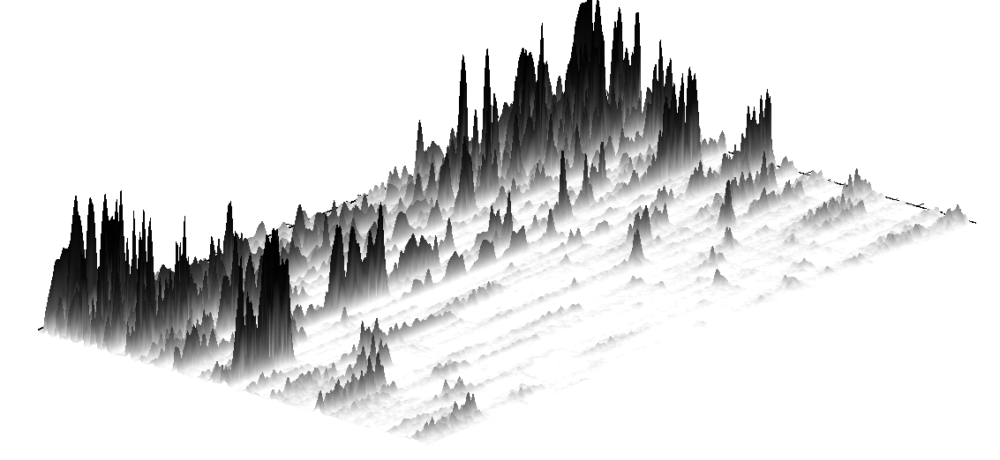

# Representación de señales de audio.

**Objetivo**. Representar señales de audio de diversas formas. La
forma estandar es en forma de onda (dB/seg).

**Espectrograma**: Representación 3D de la señal (tiempo,
frecuencia, amplitud). Se realiza un enventanado (pasar una ventana de
longitud fija por la representación en frecuencia de la señal), que
puede ser superpuestas o no.

Dependiendo de la estrategia de enventanado se consigue un espectrograma
de **banda ancha** o de **banda estrecha**:

-   *Banda ancha*: Al utilizar bandas anchas, el lobulo principal es lo
    suficientemente grande para acomodar varios armónicos consecutivos.
    Dan lugar a estrias verticales en el espectrograma.
-   *Banda estrecha*: Al utilizar ventanas mas pequeñas, es mas facil
    ver los detalles de la estructura armónica de la señal, quedando
    armónicos mas espaciados. Dan lugar a estrias horizontales en el
    espectrograma.

## Mel Frequency Cepstral Coeffs (MFCC)

Coeficientes para la representación del habla basados en la percepción
auditiva humana. Surgen de la necesidad de extraer vectores de
características de una señal de audio (habla) para extraer contenido
relevante.

Se calculan de la siguiente forma:

1.  Se separa la señal en tramos.
2.  A cada tramo se le aplica la transformada de fourier discreta y se
    obtiene la potencia espectral de la señal.
3.  Se aplica el banco de filtros Mel al espectro anterior y se suman
    las energias resultantes. El banco de filtros mel es un conjunto de
    filtros que siguen la escala Mel.
4.  Se toma el logaritmo de las energias de cada frecuencia mel.
5.  Se aplica la transformada de coseno discreta.

A grandes rasgos: se separa la señal en trozos, se aplica la TFD y el
banco de filtros mel.

## Modelo fuente-filtro

Modela la generación de voz mediante dos procesos separados e
independientes:

1.  Producción de vibración por la laringe o cavidad oral.
2.  Modificación de la vibración debido al paso por las cavidades oral,
    faringe y nasal. Forman un \"filtro\".

-   **Fuente sonora**: Frecuencias entre 50 y 500Hz.
-   **Fuente sorda**: Señal de banda ancha con un único pico entre 2kHz
    y 6kHz.

## Señales musicales

Se dice que dos notas son **disonantes** cuando sus armónicos estan
próximos pero no coinciden. Se dicen **consonantes** cuando sus
armónicos coinciden.

# Reconocimiento de locutor

**Objetivo**: Identificar o validar el locutor en una pista de audio.
Para ello, *extraer información discriminante* sobre cada locutor en
base a los archivos de entrenamiento disponibles. Esta información
discriminante corresponde a un vector de carácterísticas.

Dos tipos de variabilidades:

-   **Variabilidad intralocutor**: variabilidad intrínseca del mismo
    locutor por diversos motivos. Buscamos reducirla.
-   **Variabilidad interlocutor**: variabilidad que existe entre los
    distintos locutores. La que buscamos maximizar y discriminar con el
    método utilizado.

**Proceso de extracción de características**:

1. Realizar un enventanado (con superposición y de longitud fija) de la señal de audio (representación Amplitud(dB)-Frecuencia(Hz))
2. Sobre cada ventana realizar una transformación, ya sea extraer los coeficientes de las frecuencias Mel (MFCC) o los coeficientes de predicción lineal (LPCC) para obtener un vector de características. 

Tendríamos una matriz, es decir, por cada ventana obtendríamos un vector de parámetros, este vector de parámetros si es de la misma longitud para todas las muestras (ya que su longitud es inherente del método utilizado MFCC o LPCC). El valor que difiere es la cantidad de vectores de parámetros que tenemos. **La matriz de características de la señal no es de tamaño fijo**.

**Nota**. Al utilizarse ventanas rectangulares o Hamming, los bordes se atenuan perdiendo información. Para solucionarlo se utilizan ventanas que se solapan.

Existen tres tipos de carácterísticas:

-   **Alto nivel**: Aprendidas por el individuo: pronunciación,     acento.... Son robustas ante ruido y canales (métodos de grabación). Difíciles de extraer y aprender.
-   **Bajo nivel**: Características fisiológicas del individuo (longitud del tracto bucal). Fáciles de extraer y aprender, independientes del lenguaje. Altamente afectadas por ruido o canales.
-   **Prosódicas**. A medio camino entre las dos anteriores. Ejemplos: ritmo, energía, tono...

Los dos métodos vistos antes, MFCC y LPCC, extraen características a
bajo nivel.

## Cuantificación vectorial

**Idea**: Obtener un *codebook* por cada locutor, donde un codebook no es más que una regla de clustering (centroides). Dado un número indeterminado de vectores de D características, representartos en
$\mathbb{R}^D$ y realizar clustering (mediante k-means). Se suelen utilizar un número de clusters elevado, ya que producen modelos complejos y son más robustos.

Cuando llega una locución de test, se calcula la media de las distancias de sus características a los centroides para cada locutor. El que tenga menor distancia media es el mas probable y el resultado de la predicción.

## Mixturas de Gaussianas

**Idea.** Codificar a cada locutor mediante una mixtura de Gaussianas en $\mathbb{R}^{D}$. Lás mixturas se aprenden mediante máxima verosimilitud, por ejemplo, aplicando el algoritmo EM. Se asume que distintos vectores de características son independientes.

**Problema.** Difícil ajustar las matrices de covarianzas salvo que se tenga una gran cantidad de datos. Por ejemplo, si una componente la forman solo dos puntos, no se puede elegir una covarianza.

**Solución**. Comúnmente se reduce el número de variables en las matrices de covarianzas mediante la utilización de matrices diagonales. Es decir, solo ajustamos elipses \"rectas\" no inclinadas. Para simular que se aprender modelos inclinados, se aumenta el número de clusters y se subdividen en clusters no inclinados.

Una faceta a tener en cuenta es que el valor de la verosimilitud decrece conforme aumenta el número de vectores (la verosimilitud es un producto). Por ello, es necesario compensar esto mediante una
normalización por el número de mixturas: 

$$
    P(\mathcal{D} \mid \theta) = \prod_{t=1}^{T}P(x_t \mid \theta)^{1/T}
$$ 

Donde el valor de $T$ depende de cada fichero de audio. Esta normalización compensa en parte la incorrecta presunción de independencia entre las muestras (en un fichero de audio diferentes segmentos no son independientes, existe contexto).

### Universal Background Model (UBM)

**Idea.** Utlizar un modelo de mixtura de Gaussianas **pre-entrenado** con una altísima cantidad de datos (locutores) y re-ajustar (fine-tuning) el modelo para aprender un nuevo locutor.

La principal **ventaja** de este modelo es que es aplicable a caso donde el habla disponible del locutor es limitada. Es decir, pocos datos. Por ejemplo, *entrenamiento de altavoz alexa para aprender el habla con solo 3 repeticiones de \"alexa\", es probable que el aparato ya este entrenado para reconocer la frase en sí y solo se deba ajustar al nuevo hablante*.

Este modelo es **más robusto**, mezcla tanto la información de distintos locutores como distintos métodos de grabación posibles (micrófono profesional, móvil...).

Dos métodos principales de adaptación (fine-tunning):
-   Solo las medias de cada mixtura.
-   Todos los parámetros.

La decisión depende solamente del número de datos que se tengan.

## Kernel GSV (GMM supervector)

**Idea.** Utilizar el resultado de la mixtura de Gaussianas para crear un vector de características de tamaño fijo para cada locutor, por ejemplo, utilizar el vector de medias de las mixturas. Lo llamaremos
**supervector**, la principal ventaja es que ya tenemos un vector de características de longitud fija.

Unas de las técnicas es tomar la salida del UBM entrenado sobre el locutor, y tomar el vector de medias de cada cluster.

**Problema.** Este vector tiene **dimensionalidad muy alta**, concretamente, si trabajamos con una mixtura de 2000 componentes en un espacio de 50 características, tendríamos 100000 elementos en el supervector.

**Nuissance Attribute Projection (NAP)**. Se busca disminuir la dimensión del supervector. Para ello, se eliminan las dimensiones que más contribuyen a la varianza intralocutor, la que queremos dismiuir.

## Modelo distorsionado lineal.

En este modelo se asume que el supervector es una combinación lineal de
4 componentes

-   Componente independiente del hablante, canal y ambiente, $m_0$.
    Obtenida a partir de UBM y es constante.
-   Componente dependiente del hablante, $m_{spk}$.
-   Componente dependiente del canal y ambiente, $m_{chn}$.
-   Componente residual, $m_{res}$.

$$\bm{m} = \bm{m}_{0} + \bm{m}_{spk} + \bm{m}_{chn} + \bm{m}_{res}.$$

Las últimas 3 componentes son las encargadas de dar variabilidad al
supervector.

### Adaptaciones

### Adaptación de MAP clásica

En la actualización del GMM en UBM, el vector de medias se actualiza
como una combinación lineal de dos componentes, una dependiente del
locutor y otra independiente. Esto se puede generalizar a considerar el
supervector de la forma

$$\bm{m}_s = \bm{m}_0 + \bm{Dz}_{s}.$$

Donde la martiz $D$ es diagonal.

### Factores del hablante.

**Idea.** Restringe el modelo del hablante a un subespacio, definido
mediante las columnas de la matriz $\bm{V}$.

El modelo toma la forma:

$$ \bm{m}_s = \bm{m}_0 + \bm{V}\bm{y},$$

donde $\bm{y}$ es el vector de factores del hablante. Se puede estimar
$\bm{V}$ mediante PCA + EM.

**Nota**. Este tipo de modelos son más robustos cuando se tienen pocas
muestras de audio sobre el hablante, ya que se restringe a un espacio
más pequeño que depende del hablante. Por otro lado, no modela
variabilidad debida al canal o intralocutor.

### Factores del canal.

**Idea.** Enfoque MAP donde la variabilidaddel canal se restringe a un
subespacio $\bm{U}$ formado por los vectores propios principales de la
matriz de covarianza del canal.

$$\bm{m}_{chn} = \bm{Ux}_h \implies \bm{m}_s = \bm{m}_0 + \bm{Dz}_{s} + \bm{Ux}_h  .$$

### Analisis de factores conjuntos (FJA)

Combina las adaptaciones anteriores:

$$\bm{m}_s,h = \bm{m}_0 + \bm{Ux}_h + \bm{Vy}_s + \bm{Dz}_{s,h}.$$

Es el único modelo que explicitamente considera las 4 componentes del
modelo lineal.

**Problema.** Es dificil que unos subespacios no tengan información uno
de otros, dificil discriminar los espacios.

### Variabilidad total: i-vector.

En este modelo, se utiliza una representación dependiente del locutor y
la sesión, modelada mediante una GMM como

$$\bm{m}_{s,h} = \bm{m}_0 + \bm{Tw}_{s,h}.$$

Las variables ocultas $\bm{w}_{s,h}$ son llamadas **i-vectors**. De
forma similar al resto de representaciones, estas variables no son
observadas pero se pueden estimar mediante MAP.

Los i-vector dan información comprimida del supervector, tienen longitud
fija y no demasiado grande. El entrenamiento de la matriz de los
i-vectors es no-supervisado.

Para estimar la proyección se suele utilizar PCA. Es decir, T esta compuesto pot los autovectores de la matriz de covarianzas. Es muy costoso dado que esta matriz es muy grande.

### Resultados

Por lo general, los modelos SVM dan un mejor rendimiento que los GMM, salvo el GMM-UBM con JFA que tiene el mejor rendimiento. Uniendo un sistema GMM y una SVM se alcanza el mejor resultado de todos.

## Compensación de variabilidad intersesión

-   **WCCN (Within-class Covariance Normalization)**. Normaliza el
    kernel coseno preservando las direcciones originales en el espacio.

-   **NAP (Nuissance attribute projection)**. Busca matriz de proyección
    que elimine direcciones *molestas*.

-   **LDA (Linear Discriminant Analysis)**. Reducción de la
    dimensionalidad buscando nuevos ejes ortogonales que discriminen
    mejor las clases.

-   **PLDA (Probabilistic LDA).** Hace en i-vectors lo que Factor
    Analysis con supervectores. Entiendo que quiere decir, expresarlos
    como combinación lineal de factores independientes.

-   **JFA (Joint Factor Analysis)**. Modela subespacio de canal y locutor en
    el espacio de supervectores. Por otro lado PLDA modela subespacios
    de canal y locutor en el espacio de variabilidad total (el espacio
    de i-vectors).

## Redes neuronales

Utilización de redes neuronales y aprendizaje automático para pasar a
una representación de longitud fija partir de la matriz de caracteristicas dada por MFCC.

**A diferencia del aprendizaje de i-vectors, el aprendizaje es
supervisado.**

**Ventajas** principales de las RNN son:

-   Se pueden utilizar en un amplio rango de tareas.
-   Pueden aprender modelos de datos que "vivan" en un espacio no
    lineal.
-   No se requieren suposiciones sobre la distribucion de los datos.
-   Son buenas para explicar largas cantidades de datos sin escalar el
    tiempo de entrenamiento.

## DNNs para procesamiento de voz

La red aprende a procesar fonemas dado un archivo de audio. Se pierde la información temporal y el contexto.

Es posible darle el contexto: aumentar el tamaño de la entrada, añadir ventanas de antes y de despues. De todas formas, la red no aprende la información temporal, es solo un apaño. Surgen las **Time Delay Neural Networks** como una convolución sobre el tiempo. Primer intento de extraer x-vectors. Se crea una estructura de arbol entre las neuronas de forma que las capas mas profundas toman algunas de las salidas de la anterior (y no todas).

## Evolución historica

-   Combinación de DNN con GMM-UBM i-vectors:
    -   Se entrena la red para aprender probabilidad de cada componente de la mixtura de Gaussianas.
    -   Utilizar una de las capas de la red como el vector de características de entrada de un sistema i-vector: muy util de reconocimiento de idioma.
-   Reemplazar todo el modelo por una DNN:
    -   **d-vector**: Vector de características totalmente aprendido por una red neuronal. La red se entrenaba sobre un conjunto de entrenamiento. Para test se tomaba la media (sobre los frames del archivo de audio) de la última capa oculta. Como mejora, en lugar de utilizar una NN totalmente conectada, se utiliza una LSTM. **Text-dependent**, es decir, el locutor dice una frase concreta, no es texto libre. **Aprende un vector de probabilidades de cada locutor**.
    -   **Redes siamesas**: Discriminar si dadas dos secuencias de audio, el locutor es el mismo en ambas. **Text-independent**.
    -   **x-vector**. Lo mismo que embeddings. Entiendo que lo mismo que un **d-vector** pero con texto independiente.

## End-to-end approaches.

La red parte del conjunto de características MFCC extraidas y hace la clasificación. Por ejemplo, calcula la probabilidad de cada idioma en cada frame.

**Comparación**. Los i-vectors son independientes del idioma. En cambio, una red neuronal necesita volver a enternarse si cambia el conjunto de idiomas.

En el dataset de *Google Scorpus*, las DDN mostraron un rendimiento un 70% superior a enfoques basados en i-vectors. El dataset tenia corta duración (\~2s).

Las DDN sobrepasan a los i-vectors con muchos idiomas cuando hay mas de 10 horas de cada idioma disponible.

## Reconocimiento de idioma

**Objetivo**. Detectar el idioma hablado en conversación o grabaciones.

-   **Tokenizer**: transforma la secuencia de audio en un vector de fonemas
    reconocidos.
-   **PRLM**: dada una secuencia de fonemas aprende el modelo de idioma. Utilizado en serie con un tokenizer.
    Estos sistemas son tremendamente costosos.

Los sistemas basados en i-vectors son muy ligeros y eficientes. De todas
formas, acutalmente se usan redes profundas para esto.

La evolución temporal ha sido:

1.  Sistemas Parallel PRLM (2000-2008): costosos
2.  Sistemas i-vector (2006-2016): ligeros y eficientes.
3.  Deep NN (2012-2018): Gran rendimiento en duraciones cortas (\~3s).

### Redes end-to-end
Toman La estracción de características MFCC como entrada y calculan las probabilidades aposteriori en cada frame.

### Redes convolucionales

Se entrenan directamente del espectrograma. Peores resultados que i-vectors pero mejoran cuando se fusionan.

### Frame-by-frame bottleneck features

Se entrena una red para clasificar fonemas, con una capa intermedia de pequeña dimension "bottleneck", similar a un autoencoder. En test, tomamos los valores en esta
capa como entrada para un UBM i-vectors.

Sobrepasan el rendimiento de i-vectors normales y las DNNs.

### Recurrentes

Se realizan conexiones entre neuronas en la misma capa, de forma que en
un frame tenemos la información del anterior.

**Problema**. Vanishing gradients. **Solución**. Sustituir las neuronas
por celdas de memorias, llevando a Long Short-Term Memory Recurrent NN.

Disminuyen significativamente el error con audios de poca duración (3s).
Los i-vectors son mejores con audios de mas larga duración (30s).

## Conclusiones

-   Los i-vector y los embeddings son representaciones low-dimensional
    de tamaño fijo.
-   Los embeddings (x-vector) se benefician de grandes cantidades de datos y
    arquitecturas mas complejas.

# Diarización de Locutores

**Tarea**: dada una señal de voz, saber quién ha hablado en que
momentos. No tiene información del número de locutores, palabras o
idioma. No determina la identidad de los locutores, solo asigna
identificadores.

**Retos.** Locutores que se solapan. Ruido. Numero de locutores variable
a lo largo del tiempo. Fragmentos de audio muy cortos. Los locutores no
son facilmente distinguibles.

**Aplicaciones**. Transcripciones. Indexado de contenido.

Competiciones:

-   **CHiME-6:** Competición consistente de 4 locutores. Audio grabados
    desde Kinects con 4 microfonos cada uno. Situaciones cotidianas que
    incluyen cocina.
-   **VoxSRC 2020**: Tarea 4 de VoxCeleb.
-   **DIHARD III**. Tres ediciones. Dos tareas distintas, una de ellas
    parte desde una segmentación y la otra desde nada.

## Common pipeline

1.  Se detectan aquellas secciones del audio donde hay voz. No se tienen
    en cuenta las secciones donde no hay voz de aquí en adelante.
2.  Se toman ventanas de 1.5s o 2s y se extrae un embedding (i-vector,
    x-vector).
3.  Se hace clustering de estos embeddings, para agruparlos por
    locutores. Ej. Spectral clustering + K-means. Agglomerative
    Hierachical clustering. Bayesian HMM.
4.  Optional: refinamiento de las etiquetas (fronteras de cambio de
    locutor).

**Problema**. Cuando al fichero de audio es muy largo, hacer clustering
es muy costoso. **Solución.** Dividir el archivo antes del paso 2.
Añadir una última fase donde se enlazan los locutores de los distintos
segmentos, por ejemplo, el locutor A del segmento 1 es el mismo que el
locutor C del segmento 5.

**Desventajas**. No manejan solapamiento. No se benefician de la
existencia de varios canales de audio. Utilizan un algoritmo de
detección de actividad de voz aislado. Estos problemas no suceden en un
enfoque End-to-end con redes neuronales.

## Bayesian HMM

Modelo probabilistico, cada locutor es un nodo y se modelan
probabilidades en los cambios de locutor. Se resuelve mediante
inferencia variacional. Se hace una detección de voz antes de aplicar
este algoritmo.

**Ventajas.** Mejores resultados que agglomerative hierachical
clustering. Facil de adaptar al dominio.

**Desventajas**. No puede gestionar solapamiento de locución. Necesita
un detector de solapamiento y asignador externos. Una alta parte del
error se debe al solapamiento.

## End-to-end diarization.

**Idea general**. Utilizar una red neuronal que realice directamente
todo el proceso.

Se tiene una matriz de etiquetas como datos. Filas: frame, Columnas:
speakers (numero de speaker máximo prefijado).

Al no existir identidad de los locutores, los locutores son
intercambiables, es decir, cualquiera puede ser el speaker 1. Esto añade
el concepto de permutación de las soluciones.

**Permutación invariant training**. La función de coste es la misma se
enumeren como se enumeren los locutores. Es decir, es invariante ante
permutaciones de los identificadores de locutor.

**Problema.** Escala con el número de permutaciones de speakers. Se
soluciona con ciertos algoritmos de búsqueda de caminos.

Se adaptan estas redes al uso de **LSTM** y **modelos de atención**.

Modelo **EDA** permite un número variable de locutores y dominions
distintos, por ejemplo, cojunto de entrenamiento con llamadas
telefonicas y conjuntos de test con entrevistas y debates.

## TS-VAD (Target Speaker - Voice Activity detection)

Requiere de las características MFCC como de un i-vector por locutor. Se
toman decisiones binarias sobre la actividad de cada locutor utilizando
sus i-vectors y luego se combinan.

**Lo que yo entiendo**: Tenemos i-vectors de cada locutor y una red que
dados los i-vectors y el audio me dice si esta hablando. Aplicamos esto
a cada uno de los locutores y unimos los resultados.

## Métricas de error

-   **Diarization Error Rate (DER)**. $$
       \frac{\text{Speaker Error} + \text{False Alarm} + \text{Missed Speech}}{Total (s)}
     $$

## Combinacion de sistemas.

Combinar las salidas de los sistemas de diarizacion no es facil. Para
solventar las dificultades surge **DOVER** diarization output voting
error reduction. Realiza una votación ponderada de los resultados de
cada sistema. No consideraba solapamiento -> DOVER-LAP

# Automatic Speech Recognizers (ASR) Models

**Planteamiento**. Speech-to-text problem: dada una secuencia de audio, pasarla a texto. En general **sequence to sequence mapping**.

## Evaluación

Evaluar un sistema de STT es costoso, se requiere un conjunto de test lo suficientemente rico y transcribirlo a mano, lo cual requiere al menos 10 minutos por minuto de audio. Además es común que lo realicen más de una persona y se elija por consenso.

Se alinean la prediccion y la referencia y se estudian la siguiente casuistica palabra por palabra:

-   Acierto H.
-   Sustitucion S. La palabra predicha no es la correcta.
-   Eliminación D. No se ha predicho palabra cuando era necesario.
-   Insercion I. Se ha predicho cuando no era necesario.

Se calcula el error **World error rate** como: 

$$
WER = \frac{S+D+I}{N}.
$$ 

Se puede tener un WER > 100%, ya que las inserciones no estan acotadas. Existe un balance entre las inserciones y las eliminaciones.

Otras medidas:

-   **Phone Error Rate**. Igual a WER usando fonemas como tokens en lugar de palabras.
-   **Sentence Error Rate**. Porcentage de frases con al menos un error.
-   **Character Error Rate**. Se utilizan caracteres en lugar de palabras.

## Evolución

-   **Basados en plantillas**. *1970-1980* Se obtienen los MFCC de la señal para cada ventana y se comparaban con otros que se tenian almacenados (teniendo en cuenta ciertas deformaciones). Para cada ventana se preduce el mas cercano a las caracteristicas obtenidas.

-   **HMM-GMM**. Model generativo que genera secuencias de observaciones compatibles con el modelo.

    1.  Se transforma la secuencia en vectores de características, tipicamente usando MFCC.
    2.  Se establece un modelo probabilistico basado en HMM, un modelo de estados finito. En cada paso se genera un vector de características.
    3.  Se crea una cadena por fonema, tipicamente con 3 o 5 estados cada uno.
    4.  Cada HMM tiene asociado un GMM que modela la distribución de los vectores de características asociados a cada estado.
    5.  Se entrenan por maxima verosimilitud.

    

    Dado un vector a predecir, se selecciona aquella HMM-GMM mas probable.

    1.  Calcular la probabilidad a posteriori de cada modelo es muy costoso. Se optimiza utilizando un algoritmo forward-backward, que permite calcular las probabilidades en $t+1$ utilizando las de $t$.
    2.  Se necesita maximizar la probabilidad de cada position en un tiempo dado y el mejor camino, para ello se utiliza al algoritmo fowward-backward y el algoritmo viterbi.
    3.  El modelo se entrena mediante el algoritmo EM.

### Trifonemas

La forma de pronunciar un fonema depende fuertemente del siguiente fonema, **coarticulación**. Un modelo monofonico no puede tener en cuenta esta variabilidad, por ello, se utilizan modelos trifónicos. Esto aumenta considerablemente la complejidad del modelo.

Para reducir el número de parámetros, se puede hacer **clustering trifónico**, donde ciertos trifonemas comparten parámetros en el modelo.

- **Modelaje léxico**. Consiste en prefijar una lista de posibles palabras con su transcripción fonética.
- **Modelaje de lenguaje**. Distrinbución de probabilidad sobre las palabras. **N-grama**: la distribución de una palabra depende de las N anteriores.

### Decodificación en tiempo real

Se combinan HMM, restricciones léxicas y LM en una única red de reconocimiento. No es posible utilizar el algoritmo Viberti por lo que se utiliza un algoritmo de paso de tokens y busqueda de rayos.

### Entrenamiento de HMM

1.  **Preparación de los datos**: Lista de fonemas y léxicos con transcripciones fonéticas. Entrenar un modelo N-grama de lenguaje.
2.  **Extracción de características**: Mediante MFCC.
3.  **Entrena model monofónico**: Se comienza alineando los audios con las transcripciones utilizando segmentación uniforme. Se entrena el HMM con una única GMM y finalmente se re-estiman los HMM     incrementando el numero de Gaussianas en cada iteracion.
4.  **Entrena modelo trifónico**: Se construye el arbol de decision y el clustering de estados. Se transforman las etiquetas en etiquetas trifónicas. Se construyen modelos trifonicos replicando los
    monofonicos. Se re-estiman los modelos incrementando el numero de Gaussianas.
5.  **Entrena modelos trifónicos avanzados**. Se repite el paso 4 utilizando tecnicas mas avanzadas como Linear Discriminant analysis.
6.  **Mejora de modelos finales**. Se optimizan los modelos finales utilzando distintas técnicas como infromación mutua y DNNs.

## HMM-DNN híbridos

Primero se entrena un sistema HMM-GMM completo. Se utiliza para alinear las etiquetas de audio con los estados del HMM las cuales se utilizan como etiquetas de una DNN.

La entrada de la red son distintas ventanas de características de audio y la salida es una distribución de probabilidad sobre los estados de la HMM.

*Nota.* Para entregar una DNN es necesario tener unas etiquetas segmentadas y por lo general no se tienen. Se entrena un HMM para conseguir unas etiquetas segmentadas y se usan como etiquetas de la DNN.

## Modelos End-to-end

**Etiquetado secuencial es dificil para RNN**: Las RNN asumen independencia entre los distintos datos de entrada. Para solucionarlo, es necesario pre-segmentar los datos. Este es el motivo pro el que las **HMM** se hicieron populares, ya que pueden presegmentar los datos.

*Nota.* La red no es capaz de alinear las salidas y surgen los modelos de debajo.

### Connectionist Temporal Classification (CTC)

El modelo va frame por frame generando símbolos CTC, que consisten en un fonema o un blanco "_".

Luego el modelo comprueba que secuencia de simbolos CTC son compatibles con una secuencia de símbolos reales (cuadrar los blancos), esto es un problema porque para cada secuencia de símbolos real existen muchas secuencias de símbolos CTC.

Para solucionar este problema se utiliza el algoritmo forward-backward, que calcula la probabilidad de una secuencia.

La función de coste del modelo es optimizar el likelihood, la cual es una función de coste diferenciable. 

- **Ventajas**. Implementación simple y rápido. 
- **Desventajas**. Bajo rendimiento y aplicable a casos limitados. Asume independencia entre las salidas.

La **salida de la red** es un vector de probabilidades, concretamente, la probabilidad de que en el tiempo $t$ se observe el simbolo $k$.

**Curiosidad.** Los sistemas CTC, al añadir el simbolo blanco, este simbolo se predice casi todo el tiempo y las predicciones son cortas (solo se predice el fonema en un corto periodo de tiempo).

**Mejoras.** Decodificación basada en Weighted FST.

### RNN Transducer

Extension de CTC considerando un modelo de lenguaje (red recursiva) y una red que une ambos modelos.

Es complicada de implementar, lenta y aplicación limitada.

Se puede entrenar de forma independiente, pero obtiene mejores resultados si se pre-entrenan cada una de las redes, la CTC y la autoregresiva.

La decodificación se hace utilizando *Beam search*. 

### Attention-Based Encoder-Decoder (Att).

Esta compuesto por 3 modelos distintos:

- Un codificador: que procesa el audio y devuelve uan secuencia de embeddings. LSTM bidireccional.
- Una red de atención: procesa la secuencia de embeddings y devuelve un solo embedding.
- Un decodificador: Coge el embedding y el estado anterior para calcular el estado actual. LSTM unidireccional.

La red de decodificación sueleser mas grande que las demas.

El modelo surge de la traducción automática.

El modelo genera matrices de atención que indican para cada fonema donde esta la atención ahora (segmentación blanda).

A diferencia de las CTC, **no considera independencia entre las entradas. **

Existen distintos tipos de atención:

- Basada en el contenido: limitada a que fragmentos de habla similares en posiciones distintas tienen la misma atención (cosa que no deberian).
- Basada en la posición: Se utiliza unicamente la información del fonema anterior (la prediccion es muy dificil asi).
- Híbridas: se unen los dos conceptos anteriores y es el que usa este modelo.

### Joint CTC/Attention (Joint C/A)

CTC tiene rapida convergencia ya que obliga la secuencialidad de fonemas, cosa que no ocurre en los modelos de atencion, estos tienen que descubrir el alineamiento

El inconveniente de CTC es que asume que los frames son idenpendientes, mas allá de la recurrencia de la red que pueda tener la red. Este problema no lo tienen los metodos de atención.
La desventaja principal de los modelos de atención es la falta de restricciones de izquierda a derecha, cosa que si tienen los CTC y HMM-DNN.

La **idea** es **combinarlos** para obtener lo mejor de cada uno: un modelo que hace menos suposiciones estadisticas y utilizar un CTC para acelerar la convergencia. Para lograr esta convinación se ponderan las funciones de pérdida de cada uno de ellos.

La predicción se realiza solo con el modelo de atención y no con el CTC.

### Transformer

Todos los modelos anteriores utilizan recurrencia de una u otra forma, esto hace que sea necesario recorrer la salida de delante a atras y de atras a delante y com oresultado el entrenamiento se hace muy lento.

La **idea** principal es sustituir los modelos recurrentes por modelos de antención que ven toda la entrada simultaneamente. Se quiere **usar atención en todos los niveles del modelo**. 

Los modelos de atencion se pueden ver como una función que calcula la compatibilidad entre unas queries y unas keys. En el caso del transformer la compatibilidad es un producto escalar re-escalado a la que se le aplica una softmax.

**Muli-head attention**: la traducción de una palabra no solo depende de un punto en la frase. Se utilizan varios modelos de atencion en paralelo que se fijan en distintos puntos simultaneamente. 4 u 8 cabezas de atención. Para forzar que los cabezales se fijen en cosas distintas se utilizan proyecciones lineales a espacios distintos. 

Este **multi-head attention es el núcleo de los tansformer**, se usan tanto en el codificador como en el decofdificador, como en el sistema que une ambas redes. 

Tras los sistemas de multihead attention se le incorporan una capa feedforward y conexiones residuales.

Modifica los embeddings para que tengan información temporan para que la red conozca donde está situado el embedding en la entrada.

Existe una variable dmodel que modela la dimension de los vectores internos de la red en todo momento.

Para usar los tansformers en audio tenemos que realizar operaciones en los embedding de entrada de las redes. Se utilizan redes convolucionales y relu para reducir el numero de frames por segundo y la dimensión de la frecuencia.

El resultado es un entrenamiento mucho más rapido con el mismo performance qu elos otros modelos.